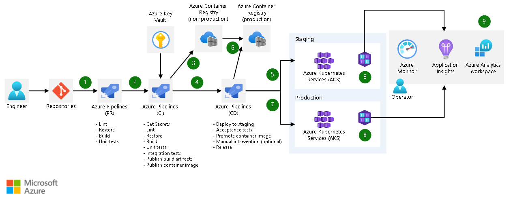

# AKS Azure Pipelines Flow

---
A pull request (PR) to Azure Repos Git triggers a PR pipeline. This pipeline runs fast quality checks such as linting, building, and unit testing the code. If any of the checks fail, the PR doesn't merge. The result of a successful run of this pipeline is a successful merge of the PR.

A merge to Azure Repos Git triggers a CI pipeline. This pipeline runs the same tasks as the PR pipeline with some important additions. The CI pipeline runs integration tests. These tests require secrets, so this pipeline gets those secrets from Azure Key Vault.

The result of a successful run of this pipeline is the creation and publishing of a container image in a non-production Azure Container Registry.

The completion of the CI pipeline triggers the CD pipeline.

The CD pipeline deploys a YAML template to the staging AKS environment. The template specifies the container image from the non-production environment. The pipeline then performs acceptance tests against the staging environment to validate the deployment. A manual validation task is run if the tests succeed, requiring a person to validate the deployment and resume the pipeline. The manual validation step is optional. Some organizations will automatically deploy.

If the manual intervention is resumed, the CD pipeline promotes the image from the non-production Azure Container Registry to the production registry.

The CD pipeline deploys a YAML template to the production AKS environment. The template specifies the container image from the production environment.

Container Insights periodically forwards performance metrics, inventory data, and health state information from container hosts and containers to Azure Monitor.

Azure Monitor collects observability data such as logs and metrics so that an operator can analyze health, performance, and usage data. Application Insights collects all application-specific monitoring data, such as traces. Azure Log Analytics is used to store all that data.

---