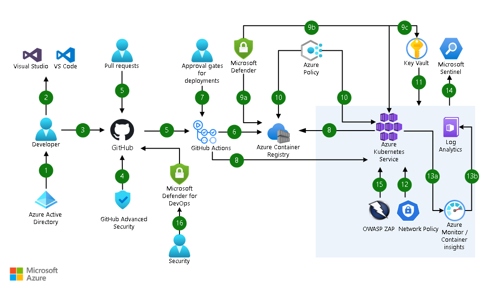

# AKS Devsecops Flow

---
Microsoft Entra ID is configured as the identity provider for GitHub. Configure multi-factor authentication (MFA) to help provide extra authentication security.

Developers use Visual Studio Code or Visual Studio with security extensions enabled to proactively analyze their code for security vulnerabilities.
Developers commit application code to a corporate owned and governed GitHub Enterprise repository.

GitHub Enterprise integrates automatic security and dependency scanning through GitHub Advanced Security.

Pull requests trigger continuous integration (CI) builds and automated testing via GitHub Actions.

The CI build workflow via GitHub Actions generates a Docker container image that is stored to Azure Container Registry.

You can introduce manual approvals for deployments to specific environments, like production, as part of the continuous delivery (CD) workflow in GitHub Actions.

GitHub Actions enable CD to AKS. Use GitHub Advanced Security to detect secrets, credentials, and other sensitive information in your application source and configuration files.

Microsoft Defender is used to scan Azure Container Registry, AKS cluster, and Azure Key Vault for security vulnerabilities.

Microsoft Defender for Containers scans the container image for known security vulnerabilities upon uploading it to Container Registry.

You can also use Defender for Containers to perform scans of your AKS environment and provides run-time threat protection for your AKS clusters.

Microsoft Defender for Key Vault detects harmful and unusual, suspicious attempts to access key vault accounts.

Azure Policy can be applied to Container Registry and Azure Kubernetes Service (AKS) for policy compliance and enforcement. 

Common security policies for Container Registry and AKS are built in for quick enablement.

Azure Key Vault is used to securely inject secrets and credentials into an application at runtime, separating sensitive information from developers.

The AKS network policy engine is configured to help secure traffic between application pods by using Kubernetes network policies.

Continuous monitoring of the AKS cluster can be set up by using Azure Monitor and Container insights to ingest performance metrics and analyze application and security logs.

Container insights retrieve performance metrics and application and cluster logs.

Diagnostic and application logs are pulled into an Azure Log Analytics workspace to run log queries.

Microsoft Sentinel, which is a security information and event management (SIEM) solution, can be used to ingest and further analyze the AKS cluster logs for any security threats based on defined patterns and rules.

Open-Source tools such as Zed Attack Proxy (ZAP) (ZAP) can be used to do penetration testing for web applications and services.

Defender for DevOps, a service available in Defender for Cloud, empowers security teams to manage DevOps security across multi-pipeline environments including GitHub and Azure DevOps.

---
