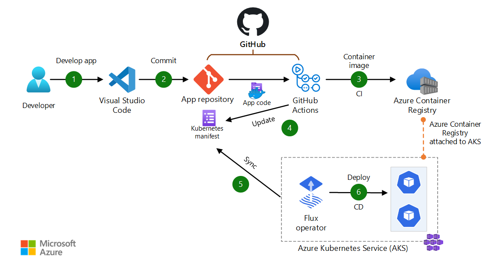
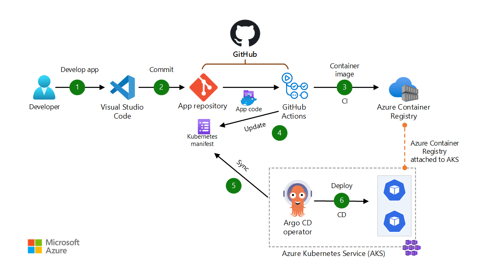

# AKS Gitops Flow 

---

## Using Flux

This scenario is a pull-based DevOps pipeline for a typical web application. The pipeline uses GitHub Actions for build. For deployment, it uses Flux as the GitOps operator to pull and sync the app. The data flows through the scenario as follows:

The app code is developed by using an IDE such as Visual Studio Code.
The app code is committed to a GitHub repository.
GitHub Actions builds a container image from the app code and pushes the container image to Azure Container Registry.
GitHub Actions updates a Kubernetes manifest deployment file with the current image version that's based on the version number of the container image in Azure Container Registry.
The Flux operator detects configuration drift in the Git repository and pulls the configuration changes.
Flux uses manifest files to deploy the app to the AKS cluster.

## Using ArgoCD

The app code is developed by using an IDE such as Visual Studio Code.
The app code is committed to a GitHub repository.
GitHub Actions builds a container image from the app code and pushes the container image to Azure Container Registry.
GitHub Actions updates a Kubernetes manifest deployment file with the current image version that's based on the version number of the container image in Azure Container Registry.
Argo CD pulls from the Git repository.
Argo CD deploys the app to the AKS cluster.

