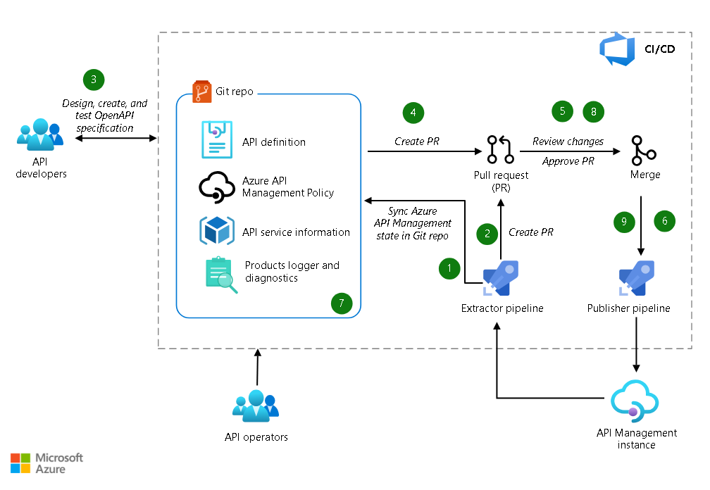

# APIM Devops Flow 

---

## Devops Flow 

API operators run the extractor pipeline to synchronize the Git repository with the API Management instance and populate the Git repository with API Management objects in the required format.

If an API change is detected in the API Management instance, a pull request (PR) is created for operators to review. Operators merge the changes into the Git repository.

API developers clone the Git repository, create a branch, and create API definitions by using the OpenAPI specification or tools of their choice.

If a developer pushes changes to the repository, a PR is created for review.

The PR can be automatically approved or reviewed, depending on the level of control that's required.

After changes are approved and merged, the publishing pipeline deploys the latest changes to the API Management instance.

API operators create and modify API Management policies, diagnostics, products, and other relevant objects, and then commit the changes.

The changes are reviewed, and they're merged after approval.

After merging the changes, the publishing pipeline deploys the changes by using the API-definitions process.

---